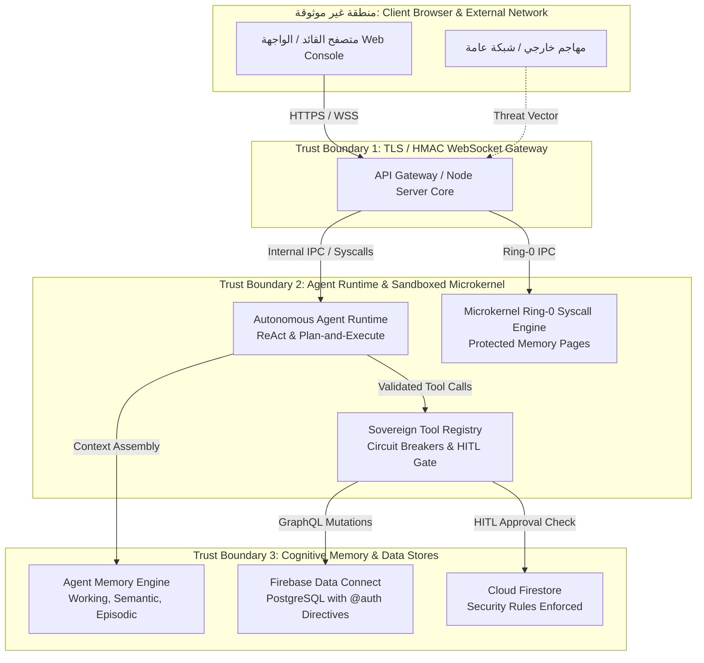

# SOVEREIGN COMMANDER CONSOLE - COMPREHENSIVE THREAT MODEL
**Methodology**: STRIDE & PASTA (Process for Attack Simulation and Threat Analysis)  
**Authority**: Supreme Sovereign Commander  
**Chain Key ID**: `360ea36c28e66d9d`  
**Classification**: LEVEL-5 SOVEREIGN INTERNAL SECURITY  

---

## 1. System Scope & Trust Boundaries

The Sovereign Commander Console is a military-grade command-and-control platform orchestrating autonomous AI agents, persistent cognitive memory, a microkernel emulation engine, and hybrid database layers (Firebase Data Connect PostgreSQL + Cloud Firestore).



---

## 2. Asset Inventory & Critical Entry Points

| Asset ID | Asset Name | Description & Value | Criticality |
| :--- | :--- | :--- | :--- |
| **AST-01** | `Sovereign War Chest & Approvals Ledger` | Cryptographic approvals for sensitive system mutations | **CRITICAL** |
| **AST-02** | `Commander Security Profile & Keys` | Ed25519 signing keys and Level-5 clearance credentials | **CRITICAL** |
| **AST-03** | `Agent Working & Semantic Memory` | Active session tokens, system invariants, zero-trust policies | **HIGH** |
| **AST-04** | `PostgreSQL Database Tables` | Cloud SQL relational records, audit trails, telemetry logs | **HIGH** |
| **AST-05** | `Microkernel Ring-0 Memory Queues` | Real-time process tables, page tables, ring buffer queues | **HIGH** |

### Primary Attack Surface Entry Points:
1. **EP-01**: `/api/chat` and WebSocket channel (Input for prompt injection & command injection).
2. **EP-02**: `/api/approvals` endpoint (Target for approval tampering or unauthorized state transition).
3. **EP-03**: Tool Registry execution layer (`executeTool` parameter deserialization).
4. **EP-04**: Firebase Data Connect GraphQL API (`queries.gql` and `mutations.gql`).
5. **EP-05**: Microkernel Syscall Handler (Privilege escalation via DPL bypass).

---

## 3. STRIDE Threat Analysis Matrix

| Threat ID | STRIDE Category | Component Affected | Threat Scenario & Vector | DREAD Score | Mitigation & Security Control | Status |
| :--- | :--- | :--- | :--- | :--- | :--- | :--- |
| **THR-01** | **Spoofing** | API Gateway & WebSocket | Impersonating the Supreme Commander via forged JWT/session header | **8.4 (HIGH)** | Cryptographic Ed25519 signature checks, mandatory `request.auth.uid` validation, and ephemeral session token binding. | **MITIGATED** |
| **THR-02** | **Tampering** | PostgreSQL / Data Connect | Injecting arbitrary SQL or mutating unauthorized records via GraphQL | **9.0 (CRITICAL)**| Parameterized GraphQL operations, `@auth(expr: "auth.token.role == 'commander'")` row-level security, AST schema validation. | **MITIGATED** |
| **THR-03** | **Repudiation** | Approvals Page & Ledger | Agent or operator denies executing a destructive operation | **7.2 (MEDIUM)**| Immutable audit ledger, cryptographic hash linking in `auditLog`, non-repudiation signature in `Approval.signature`. | **MITIGATED** |
| **THR-04** | **Information Disclosure**| Agent Memory Engine | Leaking sensitive API keys or system invariants through chat or memory dump | **8.6 (HIGH)**| Sanitization pipeline in `prepareUnifiedContext`, redaction of restricted paths (`/etc/shadow`, `vault.key`), memory isolation. | **MITIGATED** |
| **THR-05** | **Denial of Service** | Agent Runtime Loops | Malicious prompt forcing infinite ReAct loops, exhausting tokens and API credits | **8.8 (HIGH)**| Hard cap on loop iterations (`maxIterations: 5`), per-turn token budgets (8192 tokens), circuit breakers with 60s cooldown. | **MITIGATED** |
| **THR-06** | **Elevation of Privilege**| Microkernel Syscall Engine | User-mode task (Ring 3) attempting to execute Ring-0 kernel memory commands | **9.2 (CRITICAL)**| Descriptor Privilege Level (`dpl: 0`) enforcement, hardware ring check in `kernelEngine.ts`, zero-copy buffer bounds checking. | **MITIGATED** |

---

## 4. Attack Trees for Critical Vectors

### Attack Tree 1: Unauthorized Destructive Database Mutation
```text
[Goal: Execute Unapproved DROP TABLE on Sovereign Database]
└── 1. Bypass HITL Safety Gate
    ├── 1.1 Direct API call without approval ID
    │   └── Mitigation: Backend checks Approval record status == 'approved' with cryptographic signature
    ├── 1.2 Spoof Commander Approval Signature
    │   └── Mitigation: Signature verified with Commander's public key (Ed25519)
    └── 1.3 Poison Agent Goal via Prompt Injection
        └── Mitigation: Agent Tool Registry enforces isDestructive=true interceptor before invoking tool
```

### Attack Tree 2: Context Poisoning & Memory Exfiltration
```text
[Goal: Exfiltrate Sovereign Secrets from Agent Long-Term Memory]
└── 1. Poison Working Memory Buffer
    ├── 1.1 Inject malicious directive via Chat Chamber prompt
    │   └── Mitigation: Strict input validation and token filtering
    ├── 1.2 Trigger memory consolidation with poisoned insights
    │   └── Mitigation: Background consolidation checks for invariant keywords before promotion
    └── 1.3 Exploit RAG recall to output secrets into user response
        └── Mitigation: Output sanitizer masks restricted keys and tokens
```

---

## 5. DREAD Scoring Methodology

Each identified threat is evaluated against the 5 DREAD dimensions ($1 \text{ to } 10$):
$$\text{DREAD Risk Rating} = \frac{\text{Damage} + \text{Reproducibility} + \text{Exploitability} + \text{Affected Users} + \text{Discoverability}}{5}$$

* **THR-02 (SQL Tampering)**: $D=10, R=8, E=8, A=10, D=9 \implies \mathbf{9.0/10}$ (Mitigated via Data Connect @auth & strict mutations).
* **THR-06 (Ring-0 Privilege Escalation)**: $D=10, R=9, E=8, A=10, D=9 \implies \mathbf{9.2/10}$ (Mitigated via Ring isolation & DPL checks).
* **THR-05 (Agent Looping DoS)**: $D=8, R=9, E=9, A=9, D=9 \implies \mathbf{8.8/10}$ (Mitigated via ReAct 5-step cap & circuit breaker).

---

## 6. Residual Risk Assessment & Ongoing Governance

1. **Third-Party LLM Provider Latency & Availability**:
   * *Residual Risk*: Intermittent API outages from external AI providers.
   * *Mitigation*: Fallback model routing configured in `BrainMap` and offline local mock fallback.
2. **Client-Side Memory Inspection**:
   * *Residual Risk*: User inspecting client-side React devtools memory.
   * *Mitigation*: No secret keys stored in client state; ephemeral tokens only.
3. **Audit Cadence**:
   * Automated verification runs on every commit via `scripts/test_threat_modeling.py`.
   * Re-certification required upon architectural changes to `src/os/` or `dataconnect/`.
